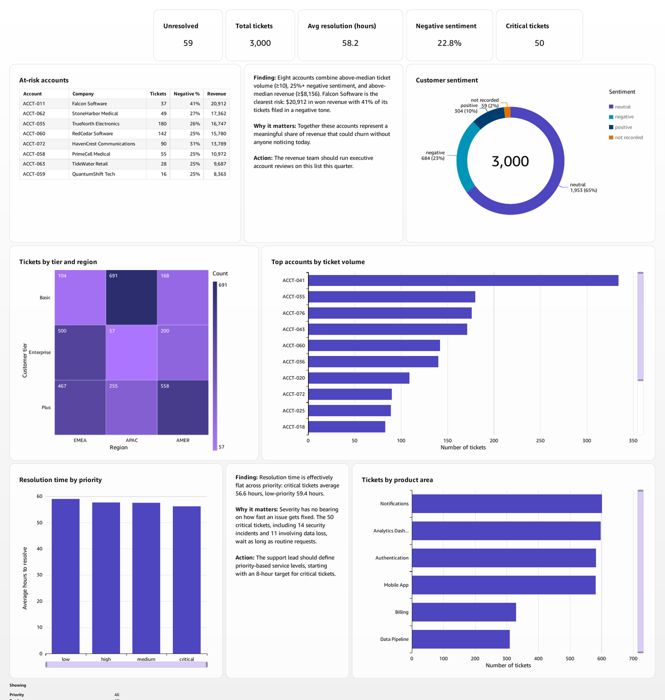
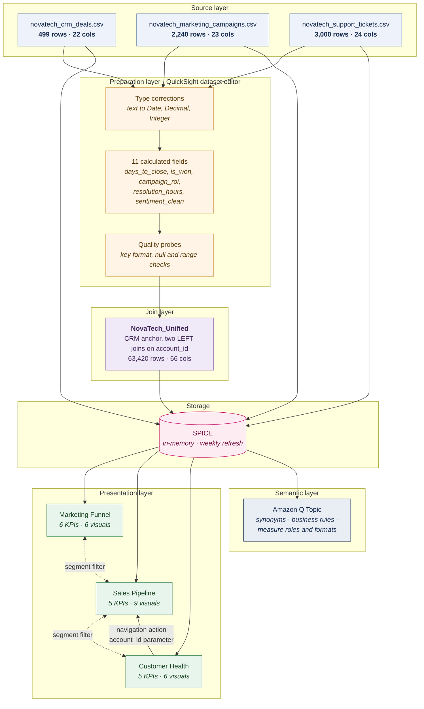
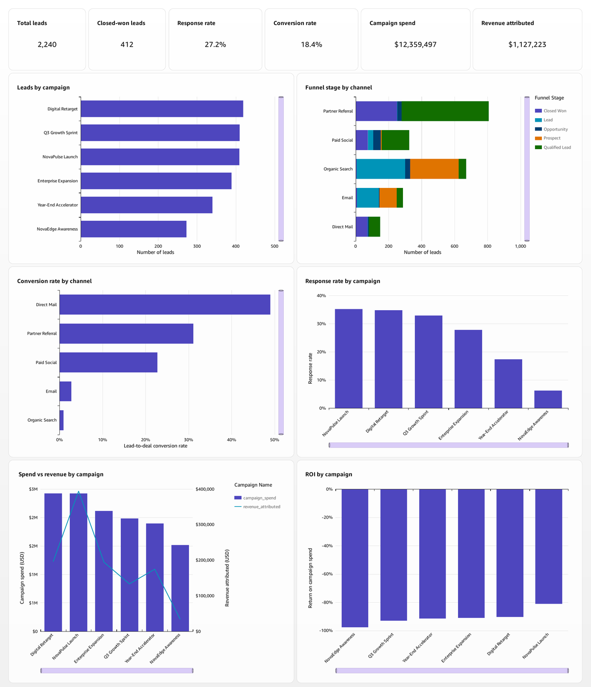
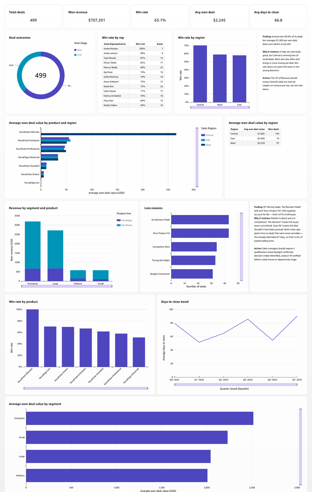

# NovaTech Revenue Intelligence Dashboard

**A three-view business intelligence system unifying marketing, sales and support data for a B2B SaaS revenue team. Built and deployed on AWS with Amazon QuickSight, with natural-language querying through Amazon Q.**

<p align="center">
  
</p>

<p align="center">
  
  
  
  
  
</p>

---

## The problem

A revenue team was working across three disconnected systems. Marketing knew which campaigns generated leads. Sales knew which deals closed. Support knew which customers were unhappy. Nobody could connect them, so nobody could see that the account generating the most support tickets was also the account generating the most revenue.

The brief was specific: one place the whole revenue team can go instead of three, with filters that work across pages, drill-down into any chart, and account-level linking so the same customer can be followed from campaign to deal to support ticket.

## Architecture



**Anchor and join type.** CRM deals is the anchor table, left-joined to marketing and then to support on `account_id`. Revenue is the spine of the analysis, so anchoring on deals keeps every deal in the result whether or not the account has marketing or support activity. That is what makes it visible that the highest-revenue account in the business was never marked as converted in marketing.

## What was built

| View | Answers |
|---|---|
| **Marketing Funnel** | Channel performance, lead-to-deal conversion, campaign return, response rates |
| **Sales Pipeline** | Deal outcomes and loss reasons, revenue by segment and product, win rates by region, rep and product, days to close, average deal value |
| **Customer Health** | Ticket volume by account, resolution times by priority, product areas driving load, sentiment, and an automated at-risk account list |

Three interaction layers connect them: a cross-sheet segment filter, a one-click filter action on the at-risk table, and a parameter-driven navigation action that carries a selected account across all three views.

<table>
<tr>
<td width="50%"><br><sub><b>Marketing Funnel</b></sub></td>
<td width="50%"><br><sub><b>Sales Pipeline</b></sub></td>
</tr>
</table>

## Findings that changed a decision

**Every campaign returns less than it costs.** $12.36M spent against $1.13M attributed, an average of -90.3% across all six campaigns. The recommendation was deliberately *not* to cut budget. A shortfall that uniform across six independently run campaigns points at one attribution problem rather than six separate failures, and cutting on those numbers risks cutting campaigns that work.

**A high win rate was concealing small deals.** Central wins 69.9% of its deals at $1,905 each. West wins 58.8% at $2,559. The regional scorecard rewarded the behaviour producing less revenue.

**Priority had no operational meaning.** Critical support tickets average 56.6 hours to resolve, low-priority tickets 59.4. Fourteen security incidents and eleven data-loss tickets were waiting as long as routine requests.

**Marketing is not crediting revenue it generated.** Tracing one account across all three views: Falcon Software received $18,473 of campaign spend, is recorded in marketing as having converted nothing, and attributes $0 of revenue. Sales closed nine deals for that same account worth $20,912. That is the -90.3% figure above, reproduced at account level, and it is why the recommendation is to audit attribution rather than cut spend.

**Eight accounts were churning quietly.** Combining above-median ticket volume, 25%+ negative sentiment and above-median revenue surfaced eight accounts nobody was tracking. The largest account by revenue, at $40,722, also files 334 support tickets, nearly double the next account.

## Engineering notes

**The join fans out, and that is correct.** Anchoring on 499 deals and left-joining 2,240 leads and 3,000 tickets on `account_id` produces 63,420 rows. Row multiplication is a legitimate consequence of the join, not a defect to clean away. It is handled at the analysis layer with distinct counts and level-aware aggregation so every deal, lead and ticket is counted once. Totals were then reconciled against the raw files: 3,000 tickets, 499 deals, 2,240 leads.

**Cross-dataset filters only auto-map on identical field names.** QuickSight matches fields by name and offers no manual field-to-field mapping, despite a dialog that implies otherwise. Filtering segment across three datasets that called it `company_size_tier`, `customer_segment` and `customer_tier` required adding a calculated column with one identical name to each dataset, then rebuilding the filter so the scan re-matched.

**A parameter control is not a filter.** Carrying an account between sheets requires three separate objects: a parameter, a control that sets it, and a filter bound to that parameter with cross-dataset scope enabled. The control alone changes a value and filters nothing, which is a silent failure, everything looks wired and nothing moves.

**Two defects found during verification changed the build.** Opportunity identifiers are reused across three account pairs, so they are not a safe unique key; the unique deal key is account plus opportunity. And the support system records three customer size tiers while the CRM records four, so the same customer carries different size labels depending on which system is asked.

## What the AI got right, and what it got wrong

Nine questions were tested against Amazon Q twice, before and after configuring a semantic Topic. The results were not uniformly positive, which is the more useful outcome. Five of nine matched the dashboard exactly.

**Configuration fixed real errors.** Asked for average deal size, Q first averaged all 499 deals and returned $1,589 for Enterprise. The dashboard reports $2,515 because it counts only won deals. Neither was arithmetically wrong, they described different populations, the hardest class of error to notice. A written instruction resolved it. Q also corrected a $1.16M arithmetic error it had made in its own written summary, where the prose understated the table it had just produced.

**Wording sensitivity was measurable.** Asked which *channel* converts best, Q correctly ranked Direct Mail first at 61%. Asked the same question about *source*, it resolved to an internal country-code field and ranked countries. Synonyms fixed that mapping.

**Configuration also caused a regression.** Both questions requiring two sources joined on account were answered correctly *before* the Topic and only partly afterwards. The Topic is scoped to the three source datasets and excludes the pre-joined view, so Q lost the bridge between tickets and deals. Semantic accuracy on single-source questions was bought at the cost of cross-source reach. That trade-off is documented rather than hidden.

**One term remains genuinely ambiguous.** "Conversion rate" is not defined as a field anywhere in the data. Q resolves it to a count of responding accounts; the dashboard measures the share of leads that close. No synonym fixes this. It needs a business decision.

## Repository contents

```
├── 01_data_preparation/
│   ├── Data_Preparation_Report.pdf      Profiling, type corrections, calculated fields, join design
│   └── Verification_Log.pdf             8 data quality checks across all three sources
├── 02_dashboard/
│   ├── 1_Marketing_Funnel.pdf
│   ├── 2_Sales_Pipeline.pdf
│   ├── 3_Customer_Health.pdf
│   └── 4_Account_Linking_Evidence.pdf   One account traced across all three views
├── 03_ai_analysis/
│   └── Q_Exploration_Log.pdf            9 questions, before/after Topic, with screenshot evidence
├── 04_reports/
│   ├── Executive_Summary.pdf            Findings, confidence levels, risks, next steps
│   └── Report_for_VP_Sarah_Chen.pdf     Non-technical stakeholder report
└── docs/                                GitHub Pages site
```

---

### Built with

**AWS** · Amazon QuickSight (deployed, region `us-west-2`) · SPICE in-memory engine · Amazon Q natural-language querying · QuickSight semantic Topic modelling
**Techniques** · Multi-source LEFT joins · fan-out-safe aggregation · calculated fields · parameters and cross-sheet actions · cross-dataset filtering
**Validation** · pandas profiling for independent ground truth

<br>

<sub>Built by **María Camila Gonzalez Nuñez** · NovaTech is a fictional company and the datasets are synthetic. Every figure in this repository was independently verified against the source files before publication.</sub>
